# Driving School Landing

A responsive landing page for a driving school with multiple device layouts (desktop, tablet, phone) and an Admin Panel for managing content.

**See Polish version:** [README.pl.md](README.pl.md)

## Overview

This repository contains the static frontend for a Driving School landing site. It includes responsive templates and assets optimized for different screen sizes. The project was finished previously and includes UI screenshots for desktop, tablet and mobile views located in the `.github` folder.

Key features
- Responsive layouts for Desktop / Tablet / Phone
- Clean, modern design focused on lead conversion
- Contact form and call-to-action sections
- Basic Admin Panel

### Desktop
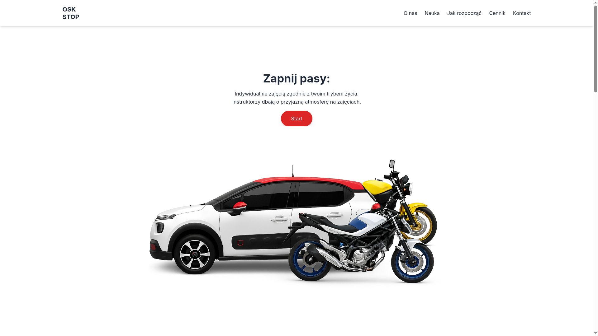
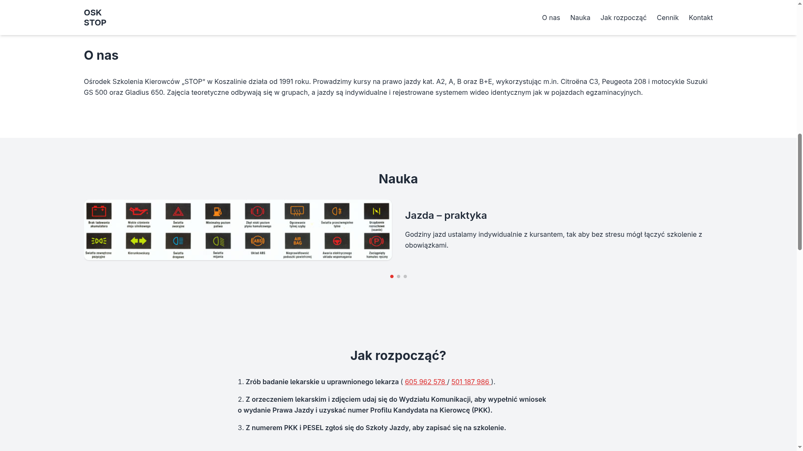
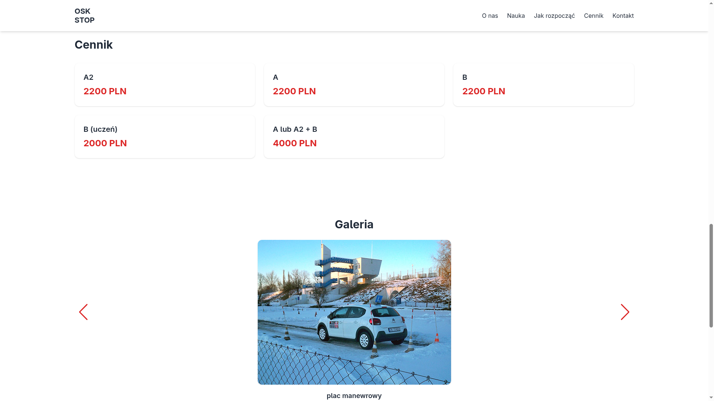
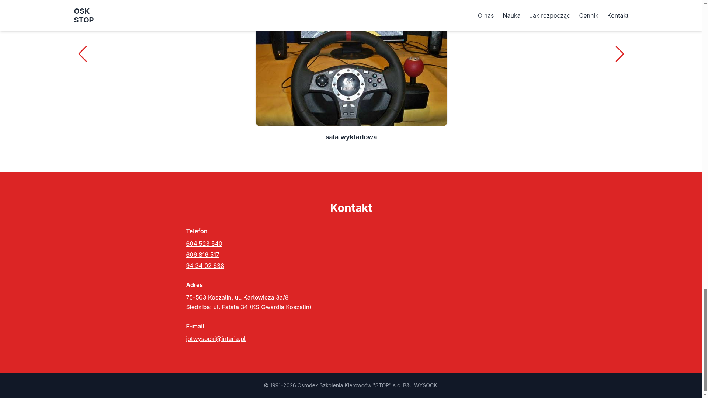

### Tablet
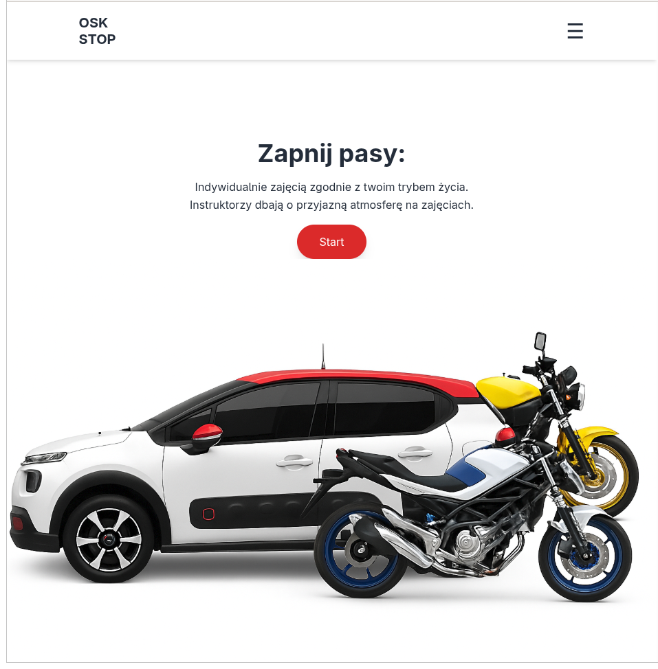
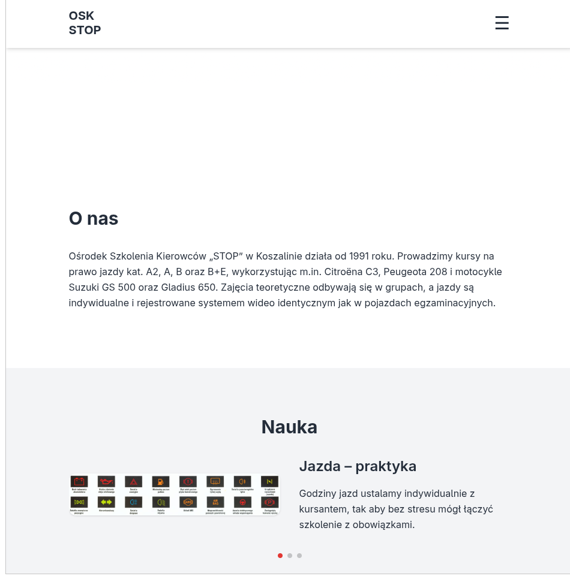
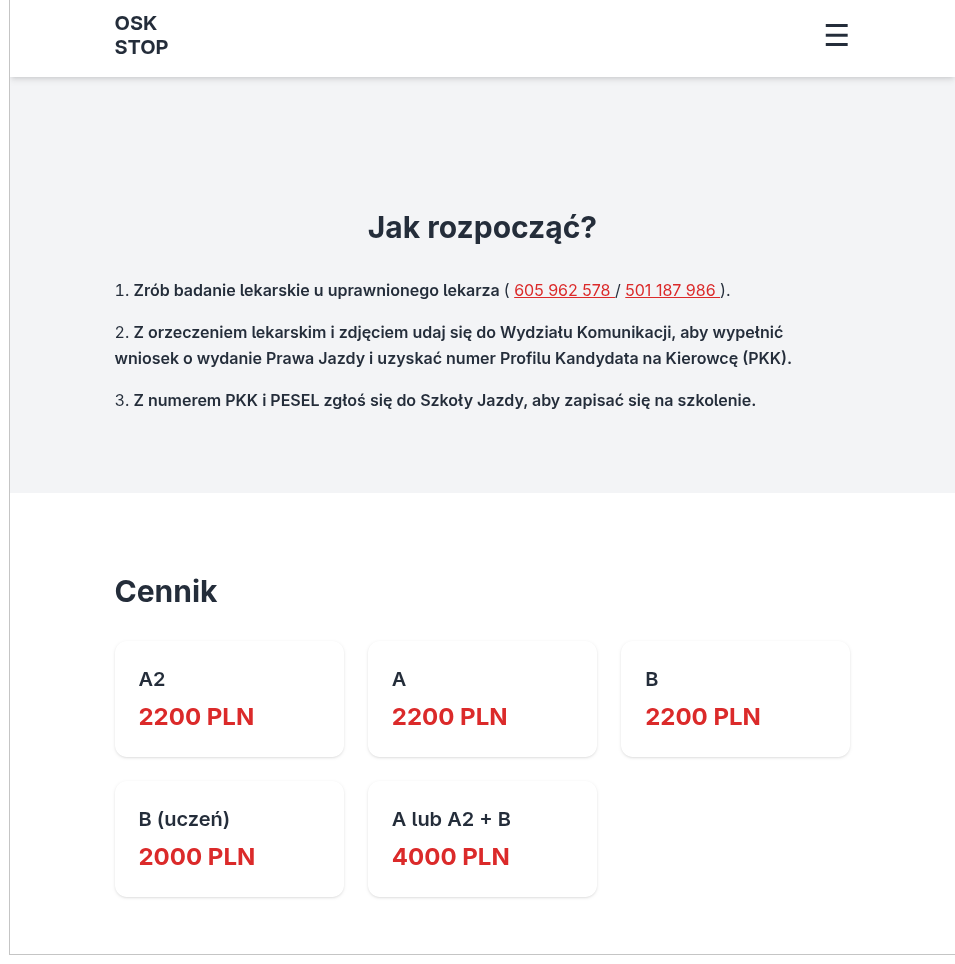
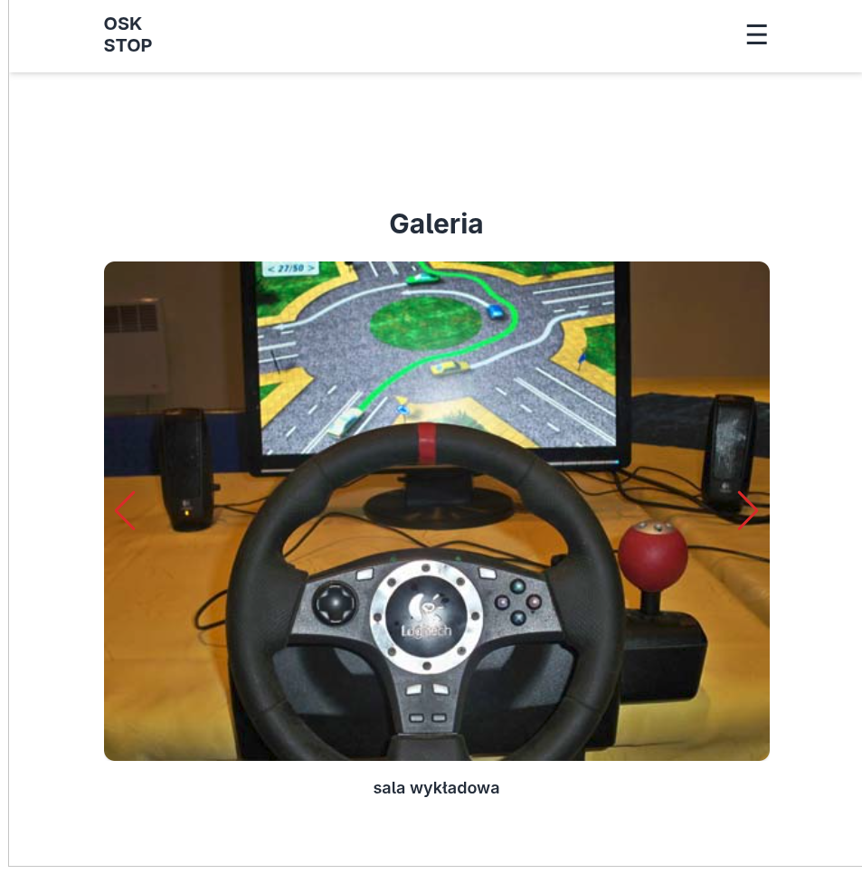
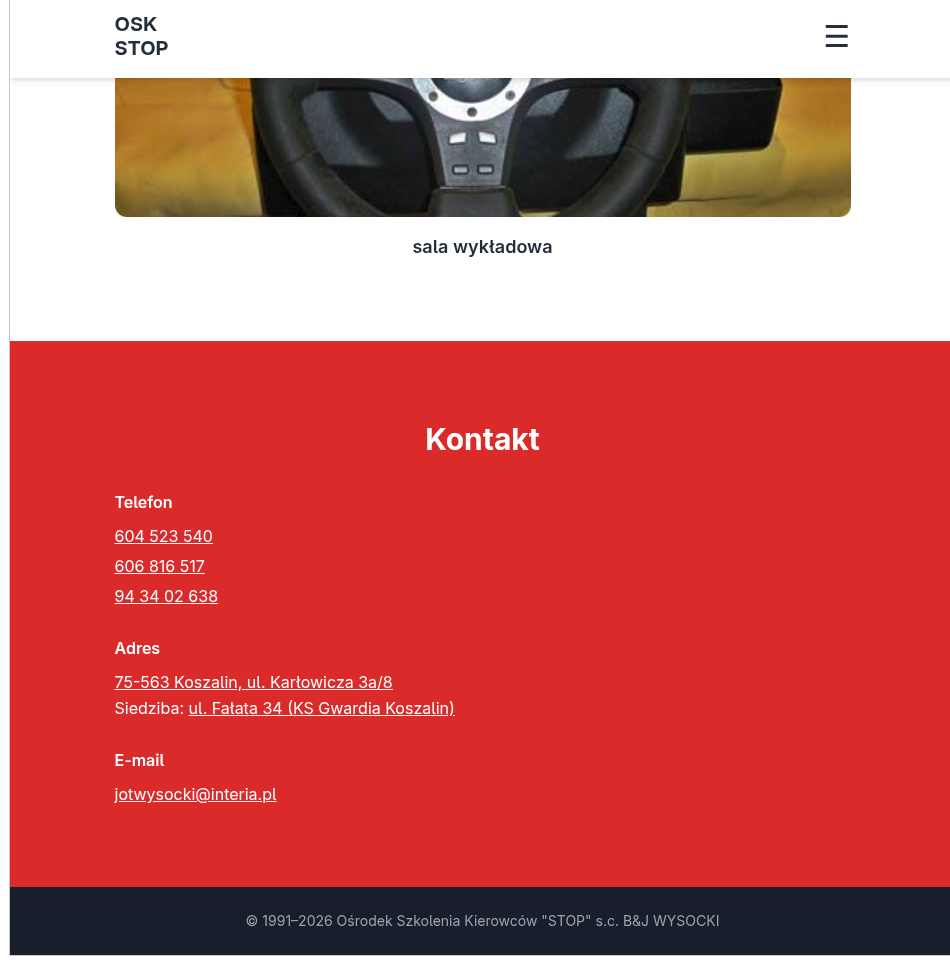

### Phone
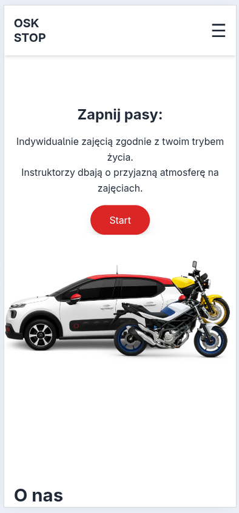
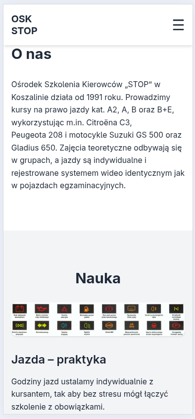
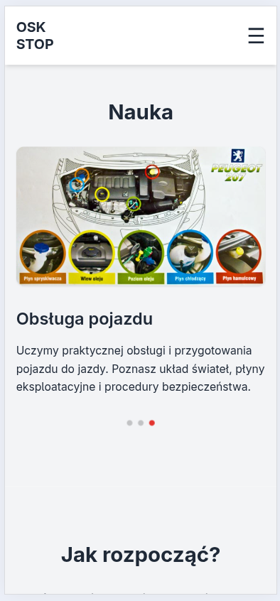
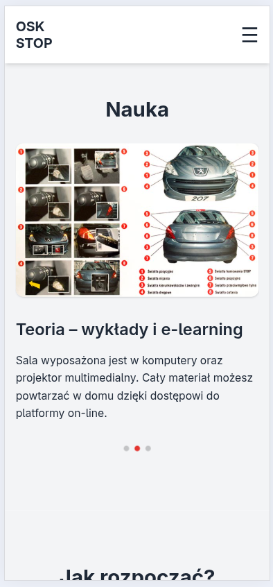

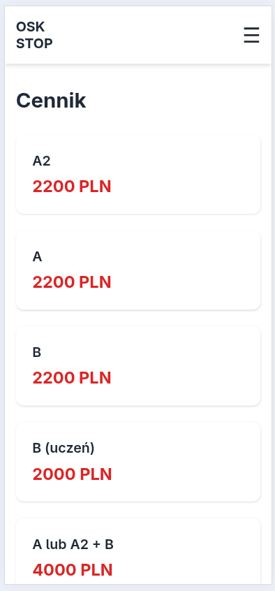
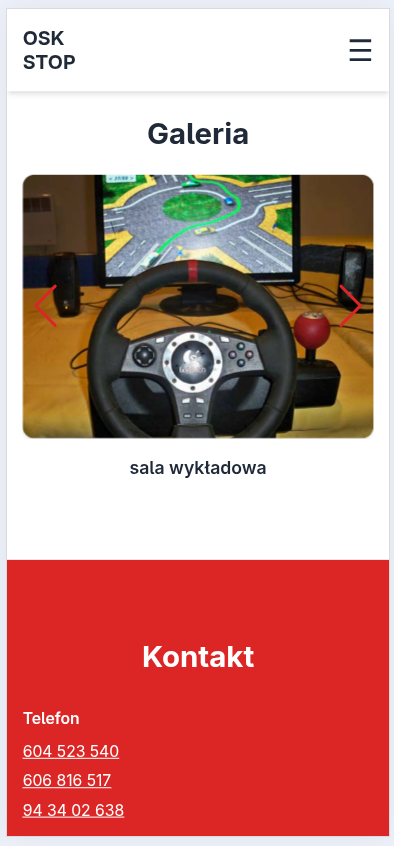
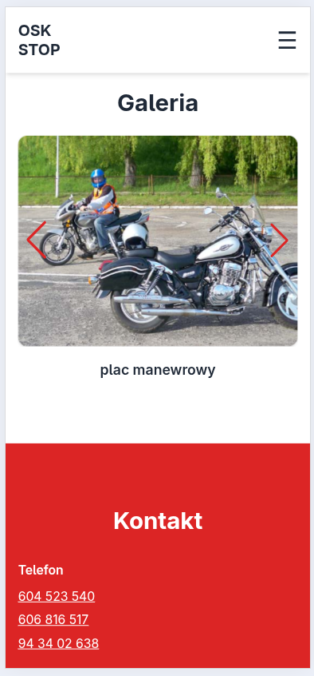
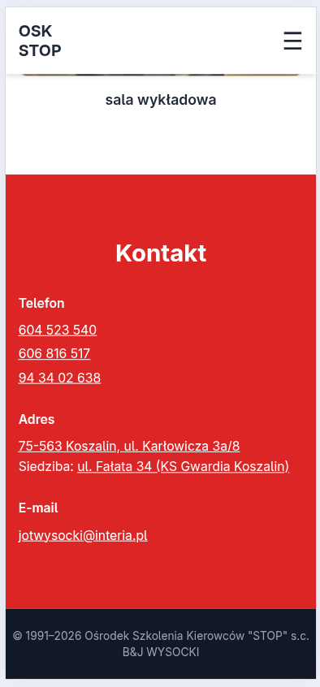

